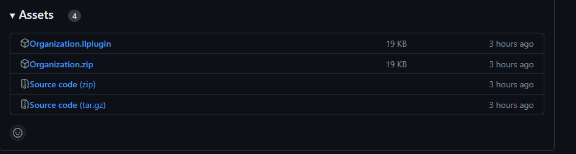
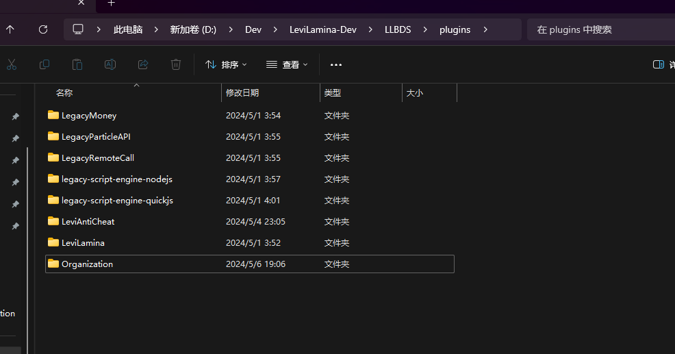

# Organization 公会

## 插件介绍

插件基于 `LegacyScriptEngine` 开发 拥有更加高性能的库和处理性能

功能:

1. 玩家多公会系统
2. 公会多管理员
3. 公会设置传送点位
4. 限制公会人数和公会传送点数
5. 设置公会总部
6. 不同等级的公会 功能更多
7. 支持设置公会积金 并且支持 LLmoney 或者 计分板 经济系统
8. 全 Gui 界面 操作简单
9. 公会主人独立权限 不受服务器玩家权限限制
10. 其他功能... 请待开发

> 该项目 `GPL-3.0` 协议开源

## 插件安装

首先您需要安装 `LSE/LLSE NodeJs` 引擎

> lip 安装

```bash
lip install gitea.litebds.com/LiteLDev/legacy-script-engine-nodejs
```

> 手动安装

下载 [legacy-script-engine-quickjs-windows-x64.zip
](https://github.com/LiteLDev/LegacyScriptEngine/releases) 并解压在 `./path/to/llbds/plugins/` 文件夹下

### 若您为 `LeviLamina` 用户

#### 方法一: 手动安装

1. 前往 [Release](https://github.com/xianyubb/Organization/releases/) 下载最新版本

您有可能看到以下场面



选择 `Organization.zip` 点击下载

> 若您访问 github.com 速度过慢 可访问镜像网站下载 [Release](https://github.bibk.top/xianyubb/Organization/releases/)
> Dev 版本可在 [Actions](https://github.com/xianyubb/Organization/actions) 里面找到 可能出现不稳定 BUG 请自行考虑是否用在生产环境

2. 将下载的压缩包解压至 `./path/to/llbds/plugins/` 文件夹下

如图所示



3. 启动服务器

若出现如下图所示情景 则说明加载成功


4. 修改配置文件

首先请关闭服务器 打开 `Organization` 目录下的 `config.json` 文件

配置文件示例 按照需要修改即可

> 真实情况下 该 json 文件不会出现注释

```json5
{
  Economy: "Score", // 经济类型 必填 "LLmoney" 或者 "Score"
  Score: "money", // 计分板名称
  allowCreate: true, // 是否允许玩家自行创建公会
  language: "zh_cn", // 语言选项 目前支持 "zh_cn" 和 "en_us"
  Normal: {
    // 普通公会配置项
    maxPlayer: 5, // 此公会最大成员
    maxTransPoints: 10, // 此公会最多传送点数
    TransMoney: 0, // 每次传送所消耗的经济
    cteateMoney: 0, // 创建此公会需要的经济
  },
  Middle: {
    // 中级公会配置项
    maxPlayer: 10,
    maxTransPoints: 20,
    TransMoney: 0,
    superMoney: 0, // 由普通升级到中级所需要的经济
  },
  High: {
    // 级公会配置项
    maxPlayer: 20,
    maxTransPoints: 30,
    TransMoney: 0,
    superMoney: 0, // 由中级升级到高级所需要的经济
  },
}
```

#### 方法二: 使用 `lip` 包管理器安装

在安装 `lip` 包管理器后 在 `LLBDS` 根目录下执行

```bash
lip install github.com/xianyubb/Organzation
```

### 若您为 `LiteLoaderBDS` 用户

1. 前往 [Release](https://github.com/xianyubb/Organization/releases/) 下载最新版本

您有可能看到以下场面


选择 `Organization.llplugin` 点击下载

> 若您访问 github.com 速度过慢 可访问镜像网站下载 [Release](https://github.bibk.top/xianyubb/Organization/releases/)
> Dev 版本可在 [Actions](https://github.com/xianyubb/Organization/actions) 里面找到 可能出现不稳定 BUG 请自行考虑是否用在生产环境

2. 将下载的文件直接放入 `./path/to/llbds/plugins/` 文件夹下

3. 启动服务器

4. 修改配置文件

> 3 4 部操作同上

## 插件功能

[下一页](./zh_cn/function.md#插件功能)